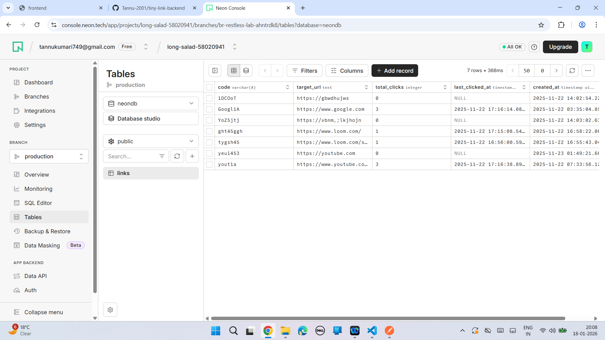
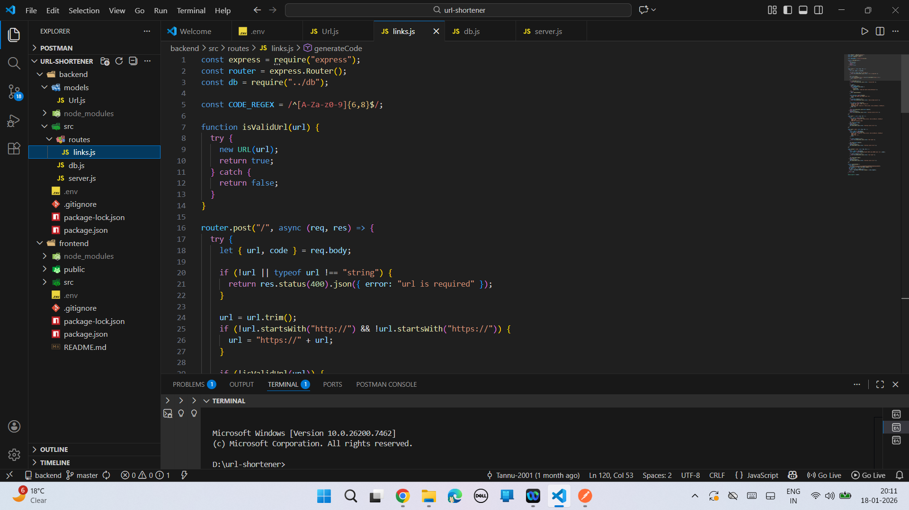

This repository contains the backend of the Tiny Link full-stack URL shortener application. It handles URL generation, redirection, and click tracking using RESTful APIs.

## Tech Stack
- Node.js
- Express.js
- PostgreSQL

## Features
- REST APIs for URL shortening
- URL redirection logic
- Click tracking for short URLs
- Database integration using PostgreSQL

## Frontend Repository
https://github.com/Tannu-2001/tiny-link-frontend

## Environment Variables
Create a .env file and add:
PORT=5000
BASE_URL=http://localhost:5000

## Run Locally
1. Clone the repository  
2. Run npm install  
3. Add environment variables  
4. Run npm start or npm run dev

## What I Learned
- Designing RESTful APIs
- Backend architecture with Express.js
- Database schema design
- Full-stack backend deployment

## Future Improvements
- User authentication (JWT)
- Advanced analytics
- Rate limiting

## Screenshots
### Neon PostgreSQL

### GET Links API

### Folder Structure

